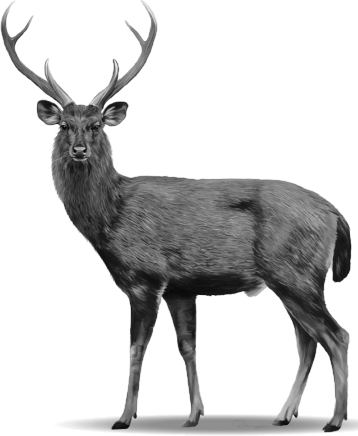

# Calculate Australia-scale biomass of 6 feral deer species and 5 large macropod species

Comparing total biomasses of feral deer and macropod species in Australia.

 
Prof <a href="https://globalecologyflinders.com/people/#DIRECTOR">Corey J. A. Bradshaw</a>  
<a href="http://globalecologyflinders.com" target="_blank">Global Ecology</a> | <em><a href="https://globalecologyflinders.com/partuyarta-ngadluku-wardli-kuu/" target="_blank">Partuyarta Ngadluku Wardli Kuu</a></em>, <a href="http://flinders.edu.au" target="_blank">Flinders University</a>, Adelaide, Australia  
April 2026  
<a href=mailto:corey.bradshaw@flinders.edu.au>e-mail</a>  
 

## Species compared
### deer
- red deer <em>Cervus elaphus</em>
- fallow deer <em>Dama dama</em>
- Sambar deer <em>Rusa unicolor</em>
- chital deer <em>Cervus axis</em>
- rusa deer <em>Rusa timorensis</em>
- hog deer <em>Axis porcinus</em>

### macropods
- red kangaroo <em>Osphranter rufus</em>
- eastern grey kangaroo <em>Macropus giganteus</em>
- western grey kangaroo <em>Macropus fuliginosusr</em>
- wallaroo <em>Osphranter robustus</em>
- Tammar wallaby <em>Notamacropus eugenii</em>

## <a href="https://github.com/cjabradshaw/deermacropodBiomass/tree/main/scripts">Scripts</a>
- <code>biomasscalc.R</code> (main code)

## R libraries
<code>ggplot2</code>, <code>ggpubr</code>
 
 

 &nbsp; 

