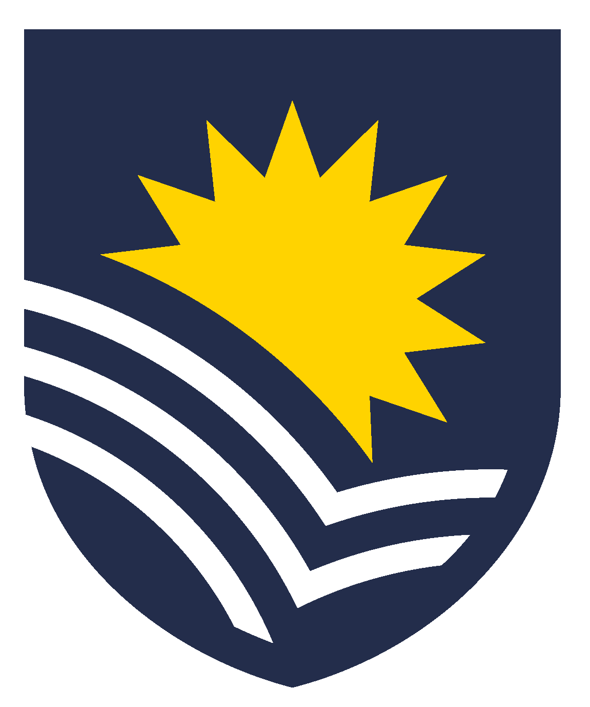

# Calculate Australia-scale biomass of 6 feral deer species and 5 large macropod species

Comparing total biomasses of feral deer and macropod species in Australia.

 
Prof <a href="https://globalecologyflinders.com/people/#DIRECTOR">Corey J. A. Bradshaw</a>  
<a href="http://globalecologyflinders.com" target="_blank">Global Ecology</a> | <em><a href="https://globalecologyflinders.com/partuyarta-ngadluku-wardli-kuu/" target="_blank">Partuyarta Ngadluku Wardli Kuu</a></em>, <a href="http://flinders.edu.au" target="_blank">Flinders University</a>, Adelaide, Australia  
April 2026  
<a href=mailto:corey.bradshaw@flinders.edu.au>e-mail</a>  
 

## Species compared
### deer

- <a href="https://feralscan.org.au/deerscan/content/deer_reddeer">red deer</a> <em>Cervus elaphus</em>
- <a href="https://feralscan.org.au/deerscan/content/deer_fallow">fallow deer</a> <em>Dama dama</em>
- <a href="https://feralscan.org.au/deerscan/content/deer_sambardeer">Sambar deer</a> <em>Rusa unicolor</em>
- <a href="https://feralscan.org.au/deerscan/content/deer_chitaldeer">chital deer</a> <em>Cervus axis</em>
- <a href="https://feralscan.org.au/deerscan/content/deer_rusadeer">rusa deer</a> <em>Rusa timorensis</em>
- <a href="https://feralscan.org.au/deerscan/content/deer_hogdeer">hog deer</a> <em>Axis porcinus</em>

### macropods

- <a href="https://australian.museum/learn/animals/mammals/red-kangaroo/">red kangaroo</a> <em>Osphranter rufus</em>
- <a href="https://australian.museum/learn/animals/mammals/eastern-grey-kangaroo/">eastern grey kangaroo</a> <em>Macropus giganteus</em>
- <a href="https://bie.ala.org.au/species/https://biodiversity.org.au/afd/taxa/e9b141fb-9c47-46a3-b631-39b175a2cd74">western grey kangaroo</a> <em>Macropus fuliginosus</em>
- <a href="https://en.wikipedia.org/wiki/Common_wallaroo">wallaroo</a> <em>Osphranter robustus</em>
- <a href="https://library.dbca.wa.gov.au/FullTextFiles/071537.pdf">Tammar wallaby</a> <em>Notamacropus eugenii</em>

## <a href="https://github.com/cjabradshaw/deermacropodBiomass/tree/main/scripts">Scripts</a>
- <code>biomasscalc.R</code> (main code)

## R libraries
<code>ggplot2</code>, <code>ggpubr</code>
 
 

 &nbsp; 

